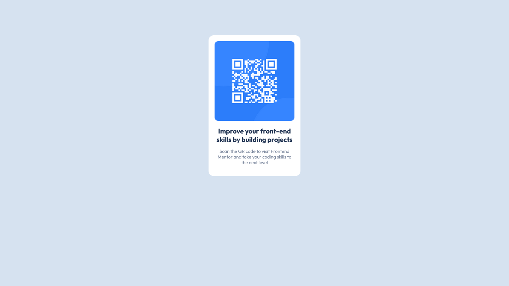

## Table of contents

- [Overview](#overview)
  - [Screenshot](#screenshot)
- [My process](#my-process)
  - [Built with](#built-with)
  - [What I learned](#what-i-learned)
  - [Continued development](#continued-development)


## Overview

### Screenshot



## My process

### Built with

- Semantic HTML5 markup
- CSS custom properties
- Flexbox
- CSS Grid


### What I learned
- I learned to adjust the image and that it does not overflow the content
- I learned to center the content of a container
```css
.container .qrcode img {
    width: 100%;
    height: 100%;
    object-fit: cover;
    border-radius: 10px;
}

.container .qrcode {
    margin: 17px;
    display: flex;
    justify-content: center;
    align-items: center;
    
}
```

### Continued development

I would like to focus more on the use of CSS grid and flexbox, as well as themes such as content centering.


